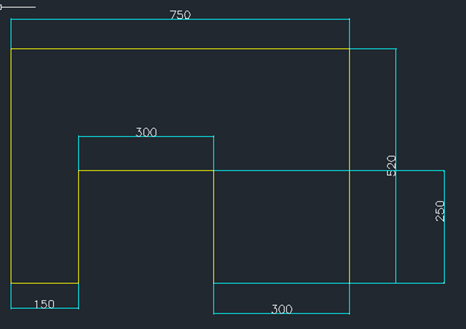
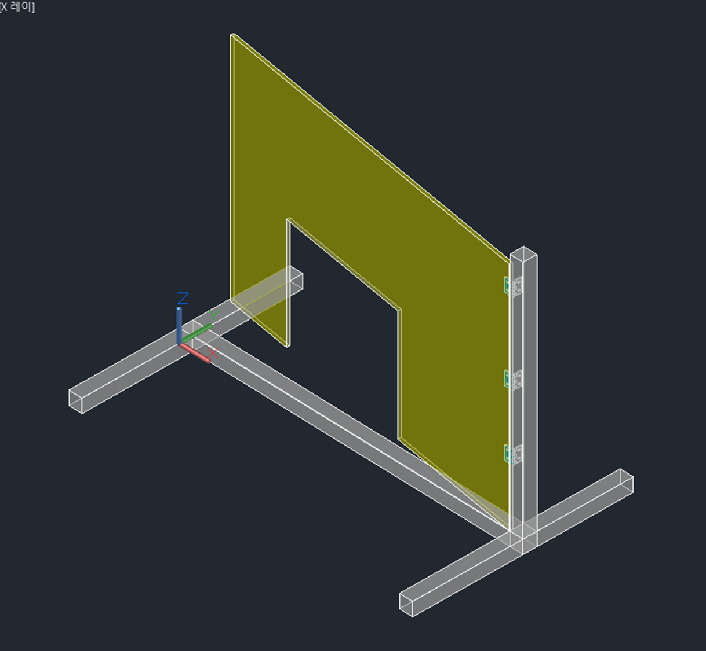
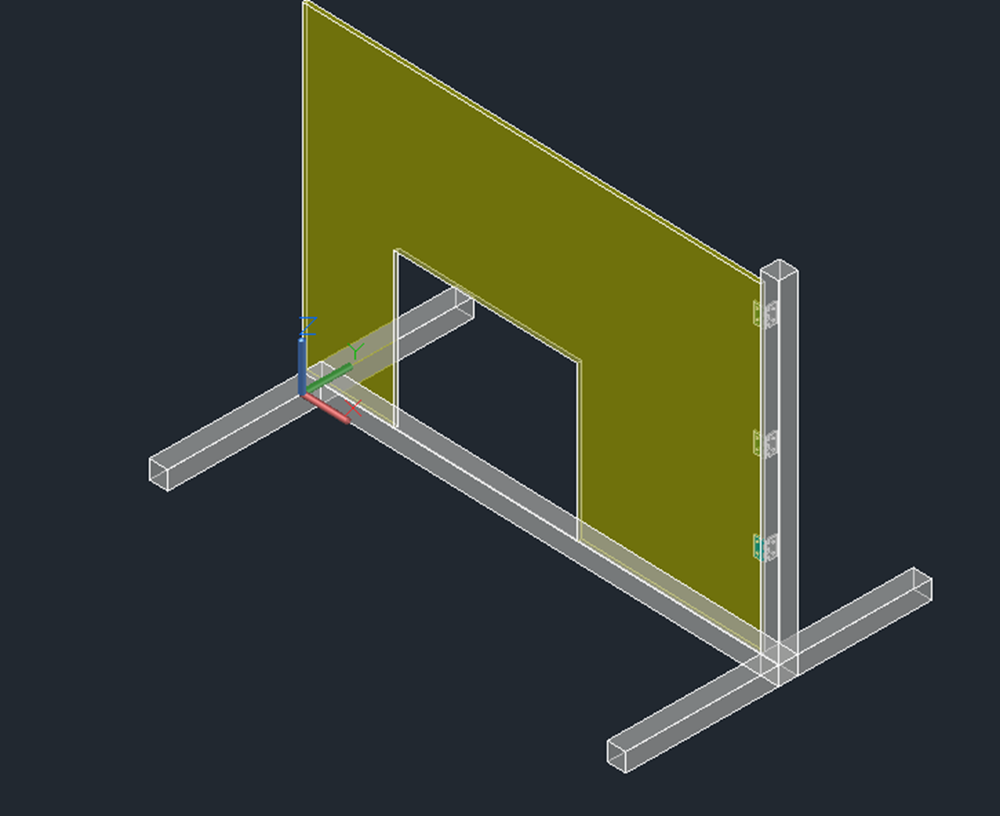

# SPLiCE
Extrinsic calibration pipeline for Crazyflie camera and multiranger sensor using checkerboard rotation model and line-based optimization.


# Crazyflie Camera-Multiranger Extrinsic Calibration

This repository contains a calibration pipeline for estimating the extrinsic parameters (R, t) 
between a camera and a multiranger distance sensor mounted on a Crazyflie drone.

## Overview
A checkerboard is rotated in front of the drone while the multiranger sensor records distance data 
and the camera captures synchronized images. 3D coordinates of the checkerboard are computed from 
the sensor data using a rotation arc model, and 2D line features are extracted from the images. 
Extrinsic parameters are estimated by minimizing the reprojection error between the 3D points 
and the detected 2D lines via two-stage Levenberg-Marquardt optimization.

## Calibration Method
<p align="center">
  
</p>
  
  
</p>
### Calibration Board Dimensions
- Overall size : 750mm × 520mm
- Hole size : 300mm × 300mm
- Hole position : 150mm from left, 250mm from bottom

### Requirements
- Position the Crazyflie **10~15cm** above the ground
- Place the checkerboard (788mm × 545mm) at **35~55cm** distance
- Stay at the starting point for at least **20 seconds**
- Rotate the checkerboard back and forth **more than 3 times**
- Rotate the checkerboard **more than 90 degrees**


## Requirements
- MATLAB (Image Processing Toolbox, Optimization Toolbox)
- Python 3 with OpenCV, NumPy


## Data Structure
```
📁 input_calibration_board/{date-trial}/
    ├── img_{timestamp}.jpg        # Raw images
    └── multiranger_data_with.txt  # ToF sensor measurements

📁 line_detected/
    ├── hough_trans/               # Hough Transform results
    └── lsd/                       # LSD results
        ├── img_{timestamp}.jpg    # Visualization
        └── img_{timestamp}.txt    # Detected line parameters

📁 output_image/{date-trial}/selected/
    ├── 3D_points/                 # Reconstructed 3D points
    ├── 2D_lines/                  # Selected 2D line features
    └── reprojection/
        ├── opti_1/                # Stage 1 optimization output
        ├── opti_2/                # Stage 2 optimization output
        └── truth/                 # Ground truth coordinates

📁 Result/{date-trial}/
    ├── extrinsic_parameter.txt    # Estimated R, t
    └── pixel_error.txt            # Reprojection error statistics
```

- `{date-trial}` — experiment ID separated by date or trial number
- `{timestamp}` — corresponds to each captured frame
